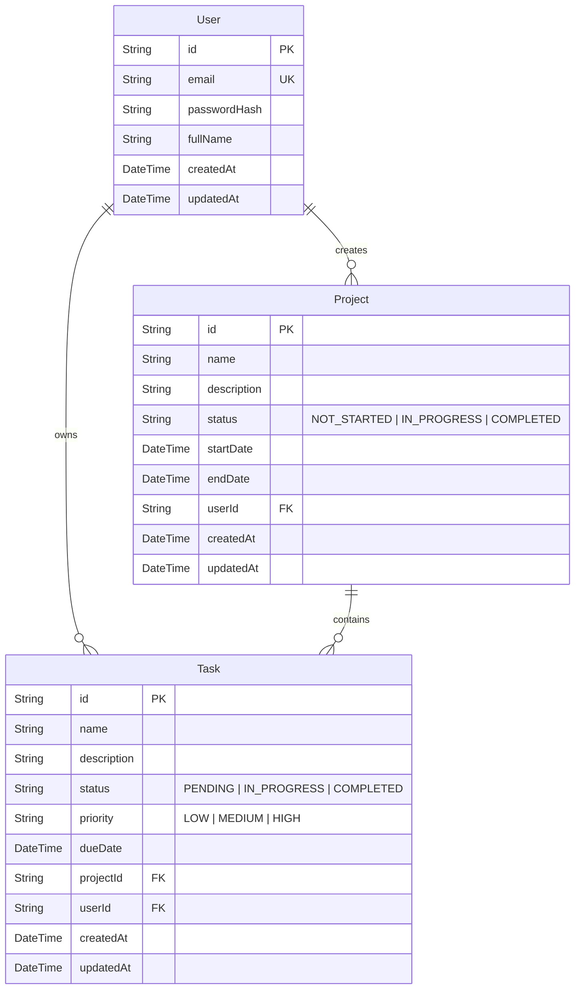

# Entity-Relationship Diagram

```mermaid
erDiagram
    User ||--o{ Project : creates
    User ||--o{ Task : owns
    Project ||--o{ Task : contains

    User {
        String id PK
        String email UK
        String passwordHash
        String fullName
        DateTime createdAt
        DateTime updatedAt
    }

    Project {
        String id PK
        String name
        String description
        String status "NOT_STARTED | IN_PROGRESS | COMPLETED"
        DateTime startDate
        DateTime endDate
        String userId FK
        DateTime createdAt
        DateTime updatedAt
    }

    Task {
        String id PK
        String name
        String description
        String status "PENDING | IN_PROGRESS | COMPLETED"
        String priority "LOW | MEDIUM | HIGH"
        DateTime dueDate
        String projectId FK
        String userId FK
        DateTime createdAt
        DateTime updatedAt
    }
```
